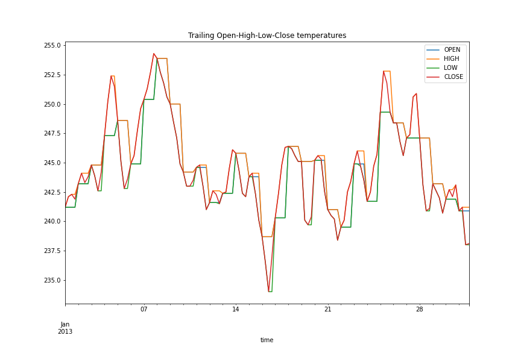

<div align="center">
</img>
</div>

# WAX-ML: A Python library for machine-learning and feedback loops on streaming data


[](https://wax-ml.readthedocs.io/en/latest/)
[](https://badge.fury.io/py/wax-ml)
[](https://codecov.io/gh/eserie/wax-ml)
[](https://github.com/ambv/black)


[**Quickstart**](#quickstart-colab-in-the-cloud)
| [**Install guide**](#installation)
| [**Change logs**](https://wax-ml.readthedocs.io/en/latest/changelog.html)
| [**Reference docs**](https://wax-ml.readthedocs.io/en/latest/)

## Introduction

🌊 Wax is what you put on a surfboard to avoid slipping. It is an essential tool to go
surfing ... 🌊

WAX-ML is a research-oriented [Python](https://www.python.org/)  library
providing tools to design powerful machine learning algorithms and feedback loops
working on streaming data.

It strives to complement [JAX](https://jax.readthedocs.io/en/latest/)
with tools dedicated to time series.

WAX-ML makes JAX-based programs easy to use for end-users working
with
[pandas](https://pandas.pydata.org/) and [xarray](http://xarray.pydata.org/en/stable/)
for data manipulation.

WAX-ML provides a simple mechanism for implementing feedback loops, allows the implementation of
 reinforcement learning algorithms with functions, and makes them easy to integrate by
end-users working with the object-oriented reinforcement learning framework from the
[Gym](https://gym.openai.com/) library.

To learn more, you can read our [article on ArXiv](http://arxiv.org/abs/2106.06524)
or simply access the code in this repository.

## WAX-ML Goal

WAX-ML's goal is to expose "traditional" algorithms that are often difficult to find in standard
Python ecosystem and are related to time-series and more generally to streaming data.

It aims to make it easy to work with algorithms from very various computational domains such as
machine learning, online learning, reinforcement learning, optimal control, time-series analysis,
optimization, statistical modeling.

For now, WAX-ML focuses on **time-series** algorithms as this is one of the areas of machine learning
that lacks the most dedicated tools.  Working with time series is notoriously known to be difficult
and often requires very specific algorithms (statistical modeling, filtering, optimal control).


Even though some of the modern machine learning methods such as RNN, LSTM, or reinforcement learning
can do an excellent job on some specific time-series problems, most of the problems require using
more traditional algorithms such as linear and non-linear filters, FFT,
the eigendecomposition of matrices (e.g. [[7]](#references)),
principal component analysis (PCA) (e.g. [[8]](#references)), Riccati solvers for
optimal control and filtering, ...


By adopting a functional approach, inherited from JAX, WAX-ML aims to be an efficient tool to
combine modern machine learning approaches with more traditional ones.


Some work has been done in this direction in [[2] in References](#references) where transformer encoder
architectures are massively accelerated, with limited accuracy costs, by replacing the
self-attention sublayers with a standard, non-parameterized Fast Fourier Transform (FFT).


WAX-ML may also be useful for developing research ideas in areas such as online machine learning
(see [[1] in References](#references)) and development of control, reinforcement learning,
and online optimization methods.

## What does WAX-ML do?

Well, building WAX-ML, we have some pretty ambitious design and implementation goals.

To do things right, we decided to start small and in an open-source design from the beginning.


For now, WAX-ML contains:
- transformation tools that we call "unroll" transformations allowing us to
  apply any transformation, possibly stateful, on sequential data.  It generalizes the RNN
  architecture to any stateful transformation allowing the implementation of any kind of "filter".

- a "stream" module, described in [🌊 Streaming Data 🌊](#-streaming-data-), permitting us to
  synchronize data streams with different time resolutions.

- some general pandas and xarray "accessors" permitting the application of any
  JAX-functions on pandas and xarray data containers:
  `DataFrame`, `Series`, `Dataset`, and `DataArray`.

- ready-to-use exponential moving average filter that we exposed with two APIs:
    - one for JAX users: as Haiku modules (`EWMA`, ... see the complete list in our
    [API documentation](https://wax-ml.readthedocs.io/en/latest/wax.modules.html)
    ).
    - a second one for pandas and xarray users: with drop-in replacement of pandas
      `ewm` accessor.

- a simple module `OnlineSupervisedLearner` to implement online learning algorithms
  for supervised machine learning problems.

- building blocks for designing feedback loops in reinforcement learning, and have
  provided a module called `GymFeedback` allowing the implementation of feedback loop as the
  introduced in the library [Gym](https://gym.openai.com/), and illustrated this figure:

  <div align="center">
  </img>
  </div>

### What is JAX?

JAX is a research-oriented computational system implemented in Python that leverages the
XLA optimization framework for machine learning computations.  It makes XLA usable with
the NumPy API and some functional primitives for just-in-time compilation,
differentiation, vectorization, and parallelization.  It allows building higher-level
transformations or "programs" in a functional programming approach.
See  [JAX's page](https://github.com/google/jax) for more details.


## Why to use WAX-ML?

If you deal with time-series and are a pandas or xarray user, b
ut you want to use the impressive
tools of the JAX ecosystem, then WAX-ML might be the right tool for you,
as it implements pandas and
xarray accessors to apply JAX functions.

If you are a user of JAX, you may be interested in adding WAX-ML to your toolbox to address
time-series problems.

## Design

### Research oriented
WAX-ML is a research-oriented library.  It relies on
[JAX](https://jax.readthedocs.io/en/latest/notebooks/quickstart.html) and
[Haiku](https://github.com/deepmind/dm-haiku) functional programming paradigm to ease the
development of research ideas.

WAX-ML is a bit like [Flux](https://fluxml.ai/Flux.jl/stable/)
in [Julia](https://julialang.org/) programming language.

### Functional programming
In WAX-ML, we pursue a functional programming approach inherited from JAX.

In this sense, WAX-ML is not a framework, as most object-oriented libraries offer.  Instead, we
implement "functions" that must be pure to exploit the JAX ecosystem.

### Haiku modules
We use the "module" mechanism proposed by the Haiku library to easily generate pure function pairs,
called `init` and `apply` in Haiku, to implement programs that require the management of
parameters and/or state variables.
You can see
[the Haiku module API](https://dm-haiku.readthedocs.io/en/latest/api.html#modules-parameters-and-state)
and
[Haiku transformation functions](https://dm-haiku.readthedocs.io/en/latest/api.html#haiku-transforms)
for more details.

In this way, we can recover all the advantages of
object-oriented programming but exposed in the functional programming approach.
It permits to ease the development of robust and reusable features and to
develop "mini-languages" tailored to specific scientific domains.


### WAX-ML works with other libraries

We want existing machine learning libraries to work well together while trying to leverage their strength.
This is facilitated with a functional programming approach.

WAX-ML is not a framework but either a set of tools that aim to complement
[JAX Ecosystem](https://moocaholic.medium.com/jax-a13e83f49897).


# Contents
* [🚀 Quickstart: Colab in the Cloud 🚀](#-quicksart-colab-in-the-cloud-)
* [⏱ Synchronize streams ⏱](#-synchronize-streams-)
* [🌊 Streaming Data 🌊](#-streaming-data-)
* [Implemented modules](#-implemented-modules-)
* [♻ Feedback loops ♻](#-feedback-loops-)
* [Future plans](#future-plans)
* [⚒ Installation ⚒](#installation)
* [Disclaimer](#disclaimer)
* [Development](#development)
* [References](#references)
* [License](#license)
* [Citing WAX-ML](#citing-wax)
* [Reference documentation](#reference-documentation)


## 🚀 Quickstart 🚀

Jump right in using a notebook in your browser, connected to a Google Cloud GPU or
simply read our notebook in the
[documentation](https://wax-ml.readthedocs.io/en/latest/).

Here are some starter notebooks:
- 〰 Compute exponential moving averages with xarray and pandas accessors 〰 : [](https://colab.research.google.com/github/eserie/wax-ml/blob/main/docs/notebooks/01_demo_EWMA.ipynb),
  [Open in Documentation](https://wax-ml.readthedocs.io/en/latest/notebooks/01_demo_EWMA.html)
- ⏱ Synchronize data streams ⏱ : [](https://colab.research.google.com/github/eserie/wax-ml/blob/main/docs/notebooks/02_Synchronize_data_streams.ipynb),
  [Open in Documentation](https://wax-ml.readthedocs.io/en/latest/notebooks/02_Synchronize_data_streams.html)
- 🌡 Binning temperatures 🌡 : [](https://colab.research.google.com/github/eserie/wax-ml/blob/main/docs/notebooks/03_ohlc_temperature.ipynb),
  [Open in Documentation](https://wax-ml.readthedocs.io/en/latest/notebooks/03_ohlc_temperature.html)
- 🎛 The three steps workflow 🎛 : [](https://colab.research.google.com/github/eserie/wax-ml/blob/main/docs/notebooks/04_The_three_steps_workflow.ipynb),
  [Open in Documentation](https://wax-ml.readthedocs.io/en/latest/notebooks/04_The_three_steps_workflow.html)
- 🔭 Reconstructing the light curve of stars with LSTM 🔭: [](https://colab.research.google.com/github/eserie/wax-ml/blob/main/docs/notebooks/05_reconstructing_the_light_curve_of_stars.ipynb),
  [Open in Documentation](https://wax-ml.readthedocs.io/en/latest/notebooks/05_reconstructing_the_light_curve_of_stars.html)
- 🦎 Online linear regression with a non-stationary environment 🦎: [](https://colab.research.google.com/github/eserie/wax-ml/blob/main/docs/notebooks/06_Online_Linear_Regression.ipynb),
  [Open in Documentation](https://wax-ml.readthedocs.io/en/latest/notebooks/06_Online_Linear_Regression.html)


## ⏱ Synchronize streams ⏱

Physicists have brought a solution to the synchronization problem called the Poincaré–Einstein
synchronization (See [Poincaré-Einstein synchronization Wikipedia
page](https://en.wikipedia.org/wiki/Einstein_synchronisation)).  In WAX-ML we have implemented a similar
mechanism by defining a "local time", borrowing Henri Poincaré terminology, to denominate the
timestamps of the stream (the "local stream") in which the user wants to apply transformations and
unravel all other streams.  The other streams, which we have called "secondary streams", are pushed
back in the local stream using embedding maps which specify how to convert timestamps from a
secondary stream into timestamps in the local stream.

This synchronization mechanism permits to work with secondary streams having timestamps at
frequencies that can be lower or higher than the local stream. The data from these secondary streams
are represented in the "local stream" either with the use of a forward filling mechanism for lower
frequencies or with a buffering mechanism for higher frequencies.

Note that this simple synchronization scheme assumes that the different event streams have fixed
latencies.

We have implemented a "data tracing" mechanism to optimize access to out-of-sync streams.  This
mechanism works on in-memory data.  We perform the first pass on the data, without actually
accessing it, and determine the indices necessary to later access the data. Doing so we are vigilant
to not let any "future" information pass through and thus guaranty a data processing that respects
causality.

The buffering mechanism used in the case of higher frequencies works with a fixed buffer size
(see the WAX-ML module [`wax.modules.Buffer`](https://wax-ml.readthedocs.io/en/latest/_autosummary/wax.modules.buffer.html#module-wax.modules.buffer)
to allow the use of JAX / XLA optimizations and efficient processing.

### Example

Let's illustrate with a small example how `wax.stream.Stream` synchronizes data streams.

Let's use the dataset "air temperature" with :
- An air temperature is defined with hourly resolution.
- A "fake" ground temperature is defined with a daily resolution as the air temperature minus 10 degrees.


```python

from wax.accessors import register_wax_accessors

register_wax_accessors()
```

```python

from wax.modules import EWMA


def my_custom_function(dataset):
    return {
        "air_10": EWMA(1.0 / 10.0)(dataset["air"]),
        "air_100": EWMA(1.0 / 100.0)(dataset["air"]),
        "ground_100": EWMA(1.0 / 100.0)(dataset["ground"]),
    }
```

```python
results, state = dataset.wax.stream(
    local_time="time", ffills={"day": 1}, pbar=True
).apply(my_custom_function, format_dims=dataset.air.dims)
```

```python
_ = results.isel(lat=0, lon=0).drop(["lat", "lon"]).to_pandas().plot(figsize=(12, 8))
```

<div align="center">
</img>
</div>

## 🌊 Streaming Data 🌊

WAX-ML may complement JAX ecosystem by adding support for **streaming data**.

To do this, WAX-ML implements a unique **data tracing** mechanism that prepares for fast
access to in-memory data and allows the execution of JAX tractable functions such as
`jit`, `grad`, `vmap`, or `pmap`.

This mechanism is somewhat special in that it works with time-series data.

The `wax.stream.Stream` object implements this idea.  It uses Python generators to
**synchronize multiple streaming data streams** with potentially different temporal
resolutions.

The `wax.stream.Stream` object works on in-memory data stored in
[`xarray.Dataset`](http://xarray.pydata.org/en/stable/generated/xarray.Dataset.html).

To work with "real" streaming data, it should be possible to implement a buffer
mechanism running on any Python generator and to use the synchronization and data
tracing mechanisms implemented in WAX-ML to apply JAX transformations on batches of data
stored in memory. (See our WEP4 enhancement proposal)

### ⌛ Adding support for time dtypes in JAX ⌛

At the moment `datetime64` and `string_` dtypes are not supported in JAX.

WAX-ML add support for `datetime64` and `string_` NumPy dtypes in JAX.
To do so, WAX-ML implements:
- an encoding scheme for `datetime64` relying on pairs of 32-bit integers similar to `PRNGKey` in JAX.
- an encoding scheme for `string_` relying on `LabelEncoder` of [Scikit-learn](https://scikit-learn.org/stable/).

By providing these two encoding schemes, WAX-ML makes it easy to use JAX algorithms on data of these types.

Currently, the types of time offsets supported by WAX-ML are quite limited and we
collaborate with the pandas, xarray, and [Astropy](https://www.astropy.org/) teams
to further develop the time manipulation tools in WAX-ML (see "WEP1" in `WEP.md`).

### pandas and xarray accessors

WAX-ML implements pandas and xarray accessors to ease the usage of machine-learning
algorithms implemented with functions implemented with Haiku modules on high-level data APIs :
- pandas's `DataFrame` and `Series`
- xarray's `Dataset` and `DataArray`.

To load the accessors, run:
```python
from wax.accessors import register_wax_accessors
register_wax_accessors()
```

Then run the "one-liner" syntax:
```python
<data-container>.stream(…).apply(…)
```

## Implemented modules

We have some modules (inherited from Haiku modules) ready to be used in `wax.modules`
(see our [api documentation](https://wax-ml.readthedocs.io/en/latest/wax.modules.html)).

They can be considered as "building blocks" that can be reused to build more advanced programs to run on streaming data.

### Fundamental modules

We have some "fundamental" modules that are specific to time series management,
- the `Buffer` module which implements the buffering mechanism
- the `UpdateOnEvent` module which allows to "freeze" the computation of a program and
  to update it on some events in the "local flow".
  To illustrate the use of this module we show how it can be used to compute the opening,
  high and closing quantities of temperatures recorded during a day,
  the binning process being reset at each day change.  We show an illustrative graph of the final result:


<div align="center">
</img>
</div>

### pandas modules

We have a few more specific modules that aim to reproduce some of the logic that **pandas** users may be familiar with,
such as:
- `Lag` to implement a delay on the input data
- `Diff` to compute differences between values over time
- `PctChange` to compute the relative difference between values over time.
- `RollingMean` to compute the moving average over time.
- `EWMA`, `EWMVar`, `EWMCov`, to compute the exponential moving average, variance, covariance of the input data.

### Online learning and reinforcement learning modules

Finally, we implement domain-specific modules for online learning and reinforcement
learning such as `OnlineSupervisedLearner` and `GymFeedback` (see dedicated sections).

### accessors

For now, WAX-ML offers direct access to some modules through specific accessors for pandas and xarray users.
For instance, we have an implementation of the "exponential moving average" directly
accessible through the accessor `<data-container>.ewm(...).mean()` which provides a
drop-in replacement for the exponential moving average of pandas.

For now, WAX-ML offers direct access to some modules through specific accessors for pandas and xarray users.

For instance, you can see our implementation of the "exponential moving average".  This
is a drop-in replacement for the exponential moving average of pandas.

Let's show how it works on the "air temperature" dataset from `xarray.tutorials`:

```python
import xarray as xr
da = xr.tutorial.open_dataset("air_temperature")
dataframe = da.air.to_series().unstack(["lon", "lat"])
```

Pandas ewma:
```python
air_temp_ewma = dataframe.ewm(alpha=1.0 / 10.0).mean()
```

WAX-ML ewma:
```python
air_temp_ewma = dataframe.wax.ewm(alpha=1.0 / 10.0).mean()
```


### Apply a custom function to a Dataset

Now let's illustrate how WAX-ML accessors work on [xarray datasets](http://xarray.pydata.org/en/stable/generated/xarray.Dataset.html).

```python
from wax.modules import EWMA


def my_custom_function(dataset):
    return {
        "air_10": EWMA(1.0 / 10.0)(dataset["air"]),
        "air_100": EWMA(1.0 / 100.0)(dataset["air"]),
    }


dataset = xr.tutorial.open_dataset("air_temperature")
output, state = dataset.wax.stream().apply(
    my_custom_function, format_dims=dataset.air.dims
)

_ = output.isel(lat=0, lon=0).drop(["lat", "lon"]).to_pandas().plot(figsize=(12, 8))
```

<div align="center">
</img>
</div>

You can see our [Documentation](https://wax-ml.readthedocs.io/en/latest/) for examples with
EWMA or Binning on the air temperature dataset.


### ⚡ Performance on big dataframes ⚡

Check out our [Documentation](https://wax-ml.readthedocs.io/en/latest/) to
see how you can use our "3-step workflow" to speed things up!


### 🔥 Speed 🔥

WAX-ML algorithms are implemented in JAX, so they are fast!

The use of JAX allows for leveraging hardware accelerators that optimize programs for the CPU, GPU, and TPU.

With WAX-ML, you can already compute an exponential moving average on a dataframe with 1 million rows with a 3x to 100x speedup
(depending on the data container you use and speed measurement methodology) compared to
pandas implementation.  (See our notebook in the
[Quick Start Documentation](https://wax-ml.readthedocs.io/en/latest/notebooks/04_The_three_steps_workflow.html)
or in
[Colaboratory](https://colab.research.google.com/github/eserie/wax-ml/blob/main/docs/notebooks/04_The_three_steps_workflow.ipynb)
).

## ♻ Feedback loops ♻

Feedback is a fundamental notion in time-series analysis and has a wide history
(see [Feedback Wikipedia page](https://en.wikipedia.org/wiki/Feedback)  for instance).
So, we believe it is important to be able to implement them well in WAX-ML.


A fundamental piece in the implementation of feedback loops is the delay operator. We implement it
with the delay module `Lag` which is itself implemented with the `Buffer` module, a module
implementing the buffering mechanism.

The linear state-space models used to model linear time-invariant systems in signal theory are a
well-known place where feedbacks are used to implement for instance infinite impulse response
filters.  This is easily implemented with the WAX-ML tools and will be implemented at
a later time.


Another example is control theory or reinforcement learning.
In reinforcement learning setup, an agent and an environment interact with a feedback loop.
This generally results in a non-trivial global dynamic.
In WAX-ML, we propose a simple module called
`GymFeedBack` that allows the implementation of reinforcement learning experiments.
This is built from an agent and an environment, both possibly having parameters and state:

<div align="center">
</img>
</div>

- The agent is in charge of generating an action from observations.
- The environment is in charge of calculating a reward associated with the agent's action and preparing
  the next observation from some "raw observations" and the agent's action, which it gives back to the
  agent.

A feedback instance `GymFeedback(agent, env)` is a function that processes the
"raw observations" and returns a reward as represented here:

<div align="center">
</img>
</div>

Equivalently, we can describe the function `GymFeedback(agent, env)`,
after transformation by Haiku transformation, by a pair of pure functions
`init` and `apply` that we describe here:

<div align="center">
</img>
</div>

We have made concrete use of this feedback mechanism in this notebook where
we give an example of online linear regression in a non-stationary environment:
- 🦎: [online learning example ](https://colab.research.google.com/github/eserie/wax-ml/blob/main/docs/notebooks/06_Online_Linear_Regression.ipynb),
  [Open in Documentation](https://wax-ml.readthedocs.io/en/latest/notebooks/06_Online_Linear_Regression.html) 🦎

Here is an illustrative plot of the final result of the study:

<div align="center">
</img>
</div>

- Left: The regret (cumulative sum of losses) first becomes concave, which means that the agent "learns something".
  Then, the regret curve has a bump at step 2000 where it becomes locally linear.
  It finally ends in a concave regime concave regime, which means that the agent has adapted to the new regime.
- Right: We see that the weights converge to the correct values in both regimes

### Compatibility with other reinforcement learning frameworks

In addition, to ensure compatibility with other tools in the Gym ecosystem, we propose a
*transformation* mechanism to transform functions into standard stateful Python objects
following the Gym API for *agents* and *environments* implemented in
[deluca](https://github.com/google/deluca).  These wrappers are in the `wax.gym` package.

WAX-ML implements *callbacks* in the `wax.gym` package.  The callback API was inspired by
the one in the one in [dask](https://github.com/dask/dask).

WAX-ML should provide tools for reinforcement learning that should complement well those
already existing such as [RLax](https://github.com/deepmind/rlax) or [deluca](https://github.com/google/deluca).

## Future plans

### Feedback loops and control theory

We would like to implement other types of feedback loops in WAX-ML.
For instance, those of the standard control theory toolboxes,
such as those implemented in the SLICOT [SLICOT](http://slicot.org/) library.

Many algorithms in this space are absent from the Python ecosystem and
we aim to provide JAX-based implementations and expose them with a simple API.

An idiomatic example in this field is the
[Kalman filter](https://fr.wikipedia.org/wiki/Filtre_de_Kalman),
a now-standard algorithm that dates back to the 1950s.
After 30 years of existence, the Python ecosystem has still not integrated
this algorithm into widely adopted libraries!
Some implementations can be found in Python libraries such as
[python-control](https://github.com/python-control/python-control),
[stats-models](https://www.statsmodels.org/stable/index.html),
[SciPy Cookbook](https://scipy-cookbook.readthedocs.io/items/KalmanFiltering.html#).
Also, some machine learning libraries have some closed and non-solved issues on this subject
, see [Scikit-learn#862 issue](https://github.com/scikit-learn/scikit-learn/pull/862)
or [River#355 issue](https://github.com/online-ml/river/pull/355).
Why has the Kalman filter not found its place in these libraries?
We think it may be because they have an object-oriented API, which makes
them very well suited to the specific problems of modern machine learning but,
on the other hand, prevents them from accommodating additional features such as Kalman filtering.
We think the functional approach of WAX-ML, inherited from JAX, could well
help to integrate a Kalman filter implementation in a machine learning ecosystem.

It turns out that Python code written with JAX is not very far from
[Fortran](https://fr.wikipedia.org/wiki/Fortran), a mathematical FORmula TRANslating
system.  It should therefore be quite easy and natural to reimplement standard
algorithms implemented in Fortran, such as those in the
[SLICOT](http://slicot.org/) library with JAX.
It seems that some questions about the integration of Fortran into
JAX has already been raised.
As noted in
[this discussion on JAX's Github page](https://github.com/google/jax/discussions/3950),
it might even be possible to simply wrap Fortran code in JAX.
This would avoid a painful rewriting process!


Along with the implementation of good old algorithms,
we would like to implement more recent ones from the online learning
literature that somehow revisits the filtering and control problems.
In particular, we would like to implement the online learning version of the
ARMA model developed in [[3]](#references)
and some online-learning versions of control theory algorithms,
an approach called "the non-stochastic control problem",
such as the linear quadratic regulator (see [[4]](#references)).

### Optimization


The JAX ecosystem already has a library dedicated to optimization:
[Optax](https://github.com/deepmind/optax), which we use in WAX-ML.
We could complete it by offering
other first-order algorithms such as the Alternating Direction Multiplier Method
[(ADMM)](https://stanford.edu/~boyd/admm.html).
One can find "functional" implementations of proximal algorithms in libraries such
as
[proxmin](https://github.com/pmelchior/proxmin)),
[ProximalOperators](https://kul-forbes.github.io/ProximalOperators.jl/latest/),
or [COSMO](https://github.com/oxfordcontrol/COSMO.jl),
which could give good reference implementations to start the work.


Another type of work took place around automatic differentiation and optimization.
In [[5]](#references) the authors implement differentiable layers based on
convex optimization in the library
[cvxpylayers](https://github.com/cvxgrp/cvxpylayers).
They have implemented a JAX API but, at the moment, they cannot use the
`jit` compilation of JAX yet
(see [this issue](https://github.com/cvxgrp/cvxpylayers/issues/103)).
We would be interested in helping to solve this issue.

Furthermore, in the recent paper [[9]](#references), the authors propose a new
efficient and modular implicit differentiation technique with a JAX-based implementation that should
lead to a new open-source optimization library in the JAX ecosystem.

### Other algorithms

The machine learning libraries [Scikit-learn](https://scikit-learn.org/stable/),
[River](https://github.com/online-ml/river),
[ml-numpy](https://github.com/ddbourgin/numpy-ml) implement many "traditional" machine
learning algorithms that should provide an excellent basis for linking or reimplementing
in JAX.  WAX-ML could help to build a repository for JAX versions of these algorithms.

### Other APIS


As it did for the Gym API, WAX-ML could add support for other high-level object-oriented APIs like
Keras, Scikit-learn, River ...


### Collaborations

The WAX-ML team is open to discussion and collaboration with contributors from any field who are
 interested in using WAX-ML for their problems on streaming data.  We are looking for use cases
 around data streaming in audio processing, natural language processing, astrophysics, biology,
 finance, engineering ...

 We believe that good software design, especially in the scientific domain, requires practical use
 cases and that the more diversified these use cases are, the more the developed functionalities
 will be guaranteed to be well implemented.

 By making this software public, we hope to find enthusiasts who aim to develop WAX-ML further!


## ⚒ Installation ⚒

You can install WAX-ML with the command:

```bash
pip install wax-ml
```

To install the latest version from source, you can use the command :

```bash
pip install "wax-ml[dev,complete] @ git+https://github.com/eserie/wax-ml.git"
```

## Disclaimer

WAX-ML is in its early stages of development and its features and API are very likely to
evolve.


## Development

You can contribute to WAX-ML by asking questions, proposing practical use cases, or by contributing to the code or the documentation.  You can have a look at our [Contributing
Guidelines](https://github.com/eserie/wax-ml/CONTRIBUTING.md) and [Developer
Documentation](https://wax-ml.readthedocs.io/en/latest/developer.html) .

We maintain a "WAX-ML Enhancement Proposals" in
[WEP.md](https://github.com/eserie/wax-ml/WEP.md) file.


## References

[1] [Google Princeton AI and Hazan Lab @ Princeton University](https://www.minregret.com/research/)

[2] [FNet: Mixing Tokens with Fourier Transforms, James Lee-Thorp, Joshua Ainslie, Ilya Eckstein, Santiago Ontanon](https://arxiv.org/abs/2105.03824)

[3] [Online Learning for Time Series Prediction, Oren Anava, Elad Hazan, Shie Mannor, Ohad Shamir](http://proceedings.mlr.press/v30/Anava13.html)

[4] [The Nonstochastic Control Problem, Elad Hazan, Sham M. Kakade, Karan Singh](https://arxiv.org/abs/1911.12178)

[5] [Differentiable Convex Optimization Layers, Akshay Agrawal, Brandon Amos, Shane Barratt, Stephen Boyd, Steven Diamond, Zico Kolter](https://arxiv.org/abs/1910.12430)

[6] [Machine learning accelerated computational fluid dynamics, Dmitrii Kochkov, Jamie A. Smith, Ayya Alieva, Qing Wang, Michael P. Brenner, Stephan Hoyer](https://arxiv.org/abs/2102.01010)

[7] [Large dimension forecasting models and random singular value spectra, Jean-Philippe Bouchaud, Laurent Laloux, M. Augusta Miceli, Marc Potters](https://arxiv.org/abs/physics/0512090)

[8] [A novel dynamic PCA algorithm for dynamic data modeling and process monitoring, Yining Dongac and S. JoeQina](https://www.sciencedirect.com/science/article/pii/S095915241730094X)

[9] [Efficient and Modular Implicit Differentiation, Mathieu Blondel, Quentin Berthet, Marco Cuturi, Roy Frostig, Stephan Hoyer, Felipe Llinares-López, Fabian Pedregosa, Jean-Philippe Vert](https://arxiv.org/abs/2105.15183)

## License

```
Copyright 2021 The WAX-ML Authors

Licensed under the Apache License, Version 2.0 (the "License");
you may not use this file except in compliance with the License.
You may obtain a copy of the License at

    https://www.apache.org/licenses/LICENSE-2.0

Unless required by applicable law or agreed to in writing, software
distributed under the License is distributed on an "AS IS" BASIS,
WITHOUT WARRANTIES OR CONDITIONS OF ANY KIND, either express or implied.
See the License for the specific language governing permissions and
limitations under the License.
```

WAX-ML bundles portions of astropy, dask, deluca, haiku, jax, xarray.

astropy, dask are available under a "3-clause BSD" license:
- dask: `wax/gym/callbacks/callbacks.py`
- astropy: `CONTRIBUTING.md`

deluca, haiku, jax and xarray are available under a "Apache" license:
- deluca: `wax/gym/entity.py`
- haiku: `docs/notebooks/05_reconstructing_the_light_curve_of_stars.*`
- jax: `docs/conf.py`, `docs/developer.md`
- xarray: `wax/datasets/generate_temperature_data.py`

The full text of these `licenses` is included in the licenses directory.


## Citing WAX-ML

If you use WAX-ML, please cite our [paper](http://arxiv.org/abs/2106.06524) using the BibTex entry:

```
@misc{sérié2021waxml,
      title={{WAX-ML}: {A} {P}ython library for machine learning and feedback loops on streaming data},
      author={Emmanuel Sérié},
      year={2021},
      eprint={2106.06524},
      archivePrefix={arXiv},
      primaryClass={cs.LG},
      url = {http://arxiv.org/abs/2106.06524},
}
```


## Reference documentation

For details about the WAX-ML API, see the
[reference documentation](https://wax-ml.readthedocs.io/en/latest/).
